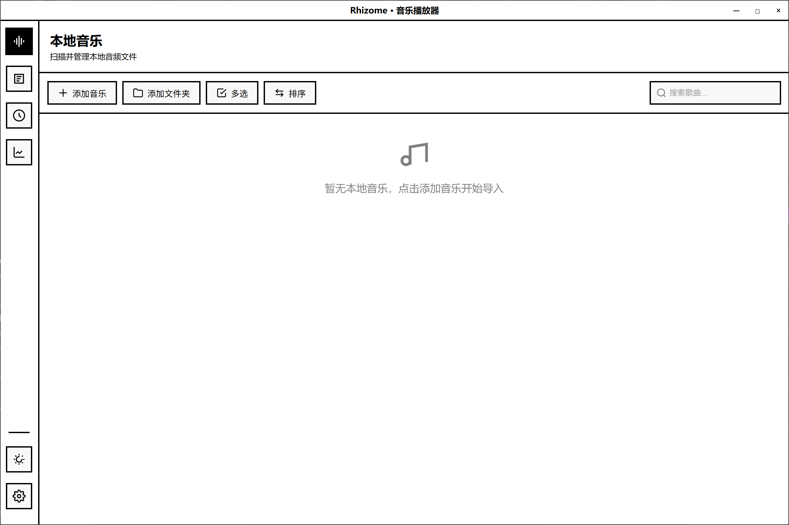
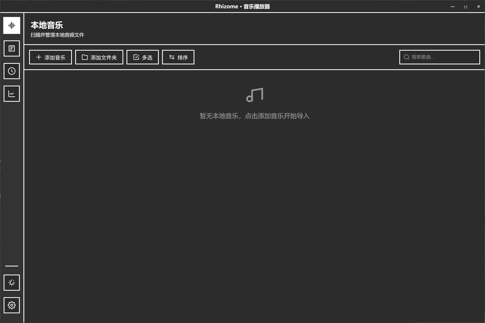

# Rhizome

简约的本地音乐播放器 · Vue 3 + Electron

## 预览





## 功能

- 本地音频管理（MP3 / FLAC / WAV）
- 歌词显示（内嵌 LRC）
- 桌面歌词（置顶透明窗口，可锁定、调整字号与对齐）
- 歌单管理（创建 / 编辑 / 多选 / 排序）
- 暗色 / 亮色主题
- 全局快捷键（可自定义）
- 频谱可视化
- 播放统计 & 定时报告（周报 / 月报 / 年报）
- 开机自启
- 数据备份与恢复（含歌单、历史、偏好设置）

## 开发

```bash
npm install          # 安装依赖
npm run electron:dev # 启动开发
npm run build        # 构建
```

## 技术栈

| 层 | 技术 |
|---|---|
| 前端 | Vue 3 (Composition API) / Pinia / Vue Router / Element Plus |
| 桌面 | Electron |
| 音频 | music-metadata |
| 构建 | Vite / electron-builder |

## 结构

```
rhizome/
├── electron/           # 主进程 & preload
│   ├── main.js         # 窗口 / IPC / 托盘 / 快捷键
│   ├── preload.js      # 音频解析、文件 IO 桥接
│   └── preload-lyrics.js
├── src/                # 渲染进程
│   ├── components/     # 播放器 / 歌词 / 弹窗
│   ├── views/          # 本地音乐 / 歌单 / 统计 / 详情
│   ├── stores/         # Pinia（曲库 / 播放器 / 歌单）
│   ├── composables/    # 主题 / 快捷键 / 频谱 / 报告
│   └── router/
├── public/
├── index.html
├── desktop-lyrics.html
└── package.json
```

## License

MIT
