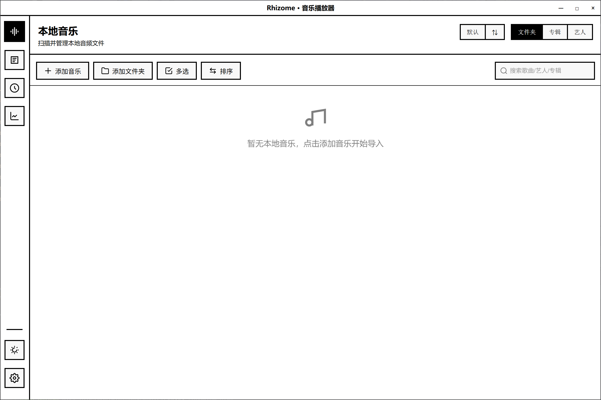
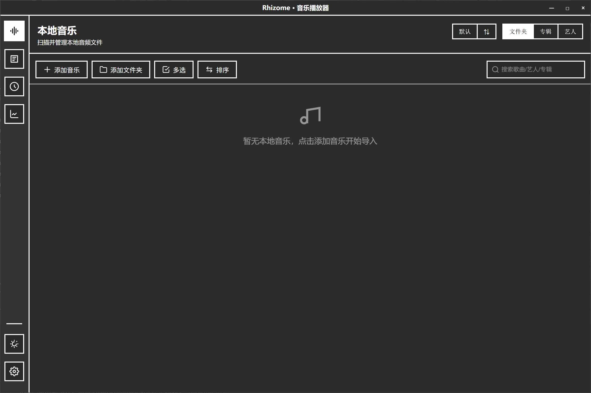

# Rhizome

简约的本地音乐播放器 · Vue 3 + Electron

## 预览




## 功能

### 音频
- 本地音频管理（MP3 / FLAC / WAV）
- 文件夹导入 & 批量扫描
- 封面提取
- 频谱可视化
- AB 循环播放

### 歌词
- 内嵌 LRC 歌词解析 & 显示
- 侧车 .lrc / .txt 歌词支持
- 桌面歌词（置顶透明窗口，可锁定拖拽、调整字号与对齐）
- 歌词取景框边框 + 播放进度边框动效
- 歌词延迟调节（±2000ms，5ms 精度）
- 桌面歌词背景透明度可调
- `Ctrl+'` 全局切换桌面歌词

### 播放
- 列表 / 循环 / 单曲 / 随机（Fisher-Yates 伪随机不重复）
- 进度条拖拽 & 滚轮微调 & AB 循环右键设点
- Media Session 系统控件集成
- 音频设备路由（热切换 & 热插拔检测）

### 歌单
- 自定义歌单（创建 / 编辑 / 排序 / 多选操作）
- 「我喜欢」固定歌单，全局心形按钮一键收藏
- 智能歌单（每周自动生成「本周最爱」+「每周发现」，保留最近 4 期）
- 歌单内拖拽排序 & 数字序号排序
- 删除确认（次数可配 1/2/3，按钮脉冲反馈）

### 统计 & 报告
- 听歌统计（总次数 / 歌曲数 / 时长 / 最爱歌手 / 排行）
- 播放记录 PNG 报告生成（卡片式排版，2x 分辨率，可设保存路径）
- 定时报告：周报 / 月报 / 年报 / 今日报告

### 数据
- 听歌日记 — 横向卡片时间线，每天精选三首歌
- 音乐时间线 — Canvas 绘制播放记录站点
- 播放历史恢复后保留元数据（缺失文件灰色删除线标记）
- 数据备份与恢复（含歌单、历史、播放记录、偏好设置）

### 界面
- 暗色 / 亮色主题
- Sdorica 风格启动动画（锁链、星环、符文、多层光环）
- 设置页选项卡布局（系统选项 / 快捷键 / 动作链）
- 全页面精密组装入场动效 & 列表项 stagger 交错延迟
- 当前播放歌曲反色高亮 & 缺失文件灰色标记
- 拖拽排序 spring 弹性反馈
- 删除按钮脉冲加速动效

### 系统
- 全局快捷键（可自定义，本地 + 全局双通道）
- 动作链（5 组可编程快捷键序列，Alt+1~5 触发）
- 屏保（空闲自动触发，时间可配 1-60min，复刻启动动画）
- 开机自启
- 系统托盘增强控制（播放/暂停/上下曲/歌词开关）

## 开发

```bash
npm install          # 安装依赖
npm run electron:dev # 启动开发（Vite + Electron）
npm run build        # 生产构建
```

## 快捷键

| 快捷键 | 功能 |
|--------|------|
| `Space` | 播放 / 暂停 |
| `←` / `→` | 上一曲 / 下一曲 |
| `↑` / `↓` | 音量增减 |
| `Ctrl+'` | 显示 / 隐藏桌面歌词 |
| `Ctrl+Shift+/` | 全局播放 / 暂停 |
| `Ctrl+←` / `Ctrl+→` | 全局上一曲 / 下一曲 |
| `Ctrl+↑` / `Ctrl+↓` | 全局音量增减 |
| `Ctrl+\` | 全局显示 / 隐藏窗口 |
| `Alt+1~5` | 触发动作链 |

## 技术栈

| 层 | 技术 |
|---|---|
| 前端 | Vue 3 (Composition API) / Pinia / Vue Router |
| 桌面 | Electron |
| 音频 | music-metadata |
| 构建 | Vite / electron-builder |

## 结构

```
rhizome/
├── electron/                # 主进程 & preload
│   ├── main.js              # 窗口管理 / IPC / 托盘 / 全局快捷键
│   ├── preload.js           # 音频解析、文件 IO、备份恢复
│   └── preload-lyrics.js    # 歌词窗口桥接
├── src/                     # 渲染进程
│   ├── components/
│   │   ├── common/          # FavoriteButton / AboutModal / SelectModal
│   │   ├── lyrics/          # DesktopLyrics
│   │   ├── player/          # GlobalPlayer / ProgressBar / VolumeControl
│   │   └── splash/          # SplashOverlay（屏保动画）
│   ├── views/
│   │   ├── MainLayout.vue   # 主布局
│   │   └── player/          # 页面组件
│   │       ├── LocalMusic.vue    # 本地音乐
│   │       ├── MyPlaylist.vue    # 歌单列表
│   │       ├── PlaylistDetail.vue# 歌单详情
│   │       ├── PlayHistory.vue   # 播放历史
│   │       ├── PlayStats.vue     # 听歌统计
│   │       ├── SongDetail.vue    # 歌曲详情
│   │       ├── MusicTimeline.vue # 音乐时间线
│   │       ├── DiaryPage.vue     # 听歌日记
│   │       └── SettingsPage.vue  # 设置
│   ├── stores/              # Pinia（playerStore / localMusicStore / playlistStore）
│   ├── composables/         # 可复用逻辑
│   │   ├── useGlobalTheme.js     # 主题切换
│   │   ├── useShortcuts.js       # 快捷键
│   │   ├── useSpectrumEngine.js  # 频谱
│   │   ├── useEqualizer.js       # 均衡器
│   │   ├── useAudioDevice.js     # 音频设备
│   │   ├── useReportGenerator.js # 报告生成
│   │   ├── useFavorites.js       # 收藏
│   │   ├── useWeeklyPlaylists.js # 智能歌单
│   │   ├── useActionChain.js     # 动作链
│   │   ├── useSongList.js        # 排序/多选/拖拽
│   │   ├── usePageEnter.js       # 入场动效
│   │   ├── useDeleteConfirm.js   # 删除确认
│   │   ├── useLyricOffset.js     # 歌词延迟
│   │   ├── useIdleTimeout.js     # 屏保定时状态
│   │   ├── useIdle.js            # 空闲检测
│   │   ├── useCurrentSongHighlight.js # 当前曲目高亮
│   │   └── useColorExtractor.js  # 封面取色
│   ├── assets/
│   │   └── css/
│   │       ├── global-theme.css  # 主题变量 & 全局动效
│   │       ├── global.css        # 全局样式
│   │       └── reset.css         # 样式重置
│   ├── utils/               # 工具函数
│   │   ├── format.js             # 时间格式化
│   │   ├── song-factory.js       # 歌曲对象构造
│   │   └── lyrics.js             # 歌词解析
│   ├── constants/           # 常量
│   │   ├── storage-keys.js       # localStorage 键
│   │   └── defaults.js           # 默认配置
│   └── router/
├── public/
├── index.html               # 入口（含启动动画）
├── desktop-lyrics.html      # 桌面歌词窗口入口
└── package.json
```

## License

MIT
